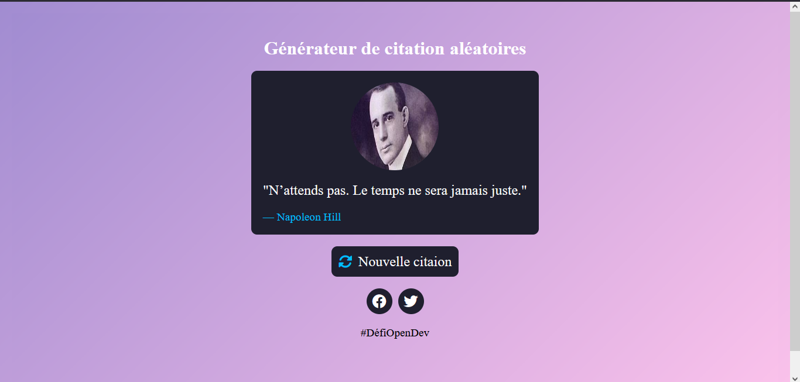
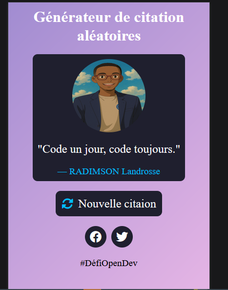

# 🎯 Générateur de Citations Aléatoires – Défi OpenDev Mada Semaine 2

Bienvenue dans mon petit projet réalisé dans le cadre du **Mini Défi de la Semaine #2** de la communauté **OpenDev Mada** !

> **Défi :** Créer une application simple qui affiche une citation différente à chaque clic, avec un design élégant et une interface utilisateur soignée.

---

## 🖼️ Aperçu

---

## 🚀 Fonctionnalités

- 💬 Affiche une **citation aléatoire** à chaque clic sur le bouton.
- 🧑‍🎨 Affiche également la **photo de l’auteur**.
- 🎨 Design responsive, inspiré d’un mockup pro.
- ⚡ Utilisation simple de **HTML, CSS et JavaScript pur**.

---

## 🛠️ Technologies utilisées

- HTML5
- CSS3 (Flexbox & responsive design)
- JavaScript (DOM, tableaux, événements)

---

## 📁 Structure du projet

